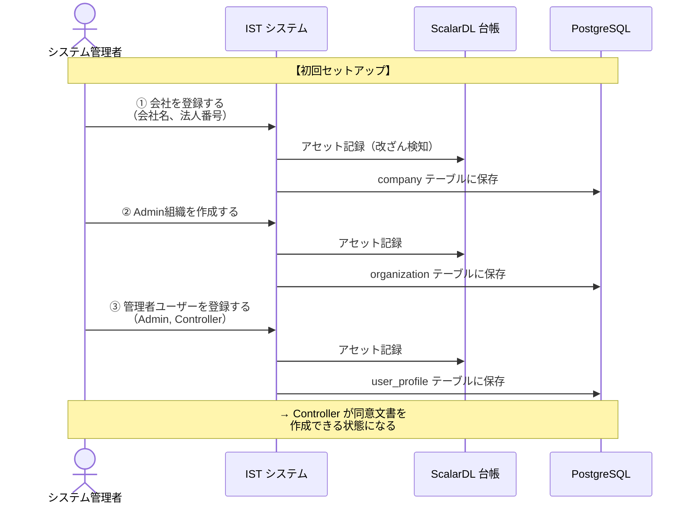
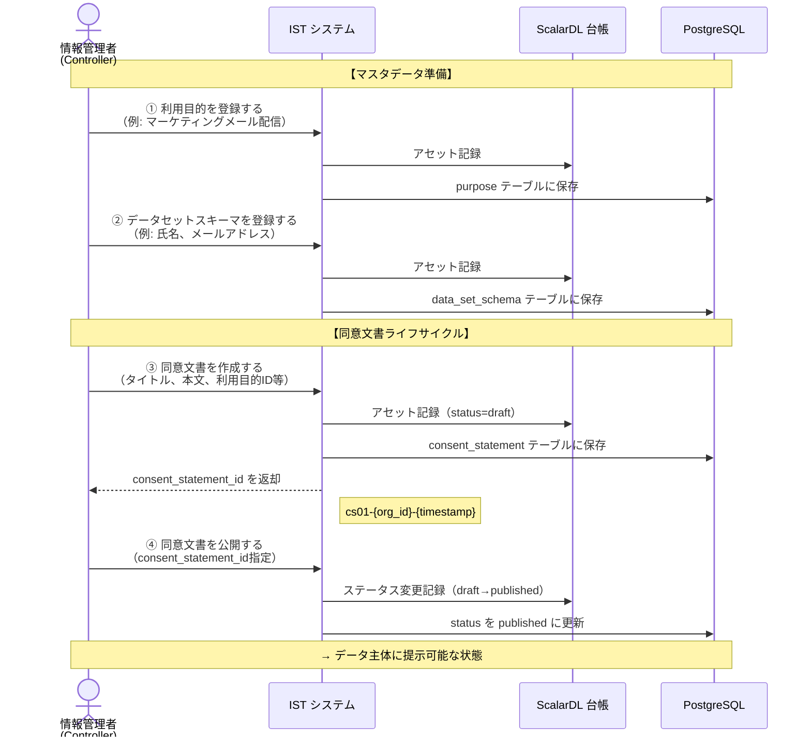
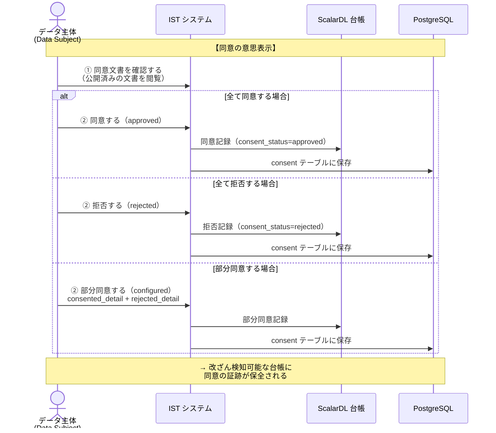
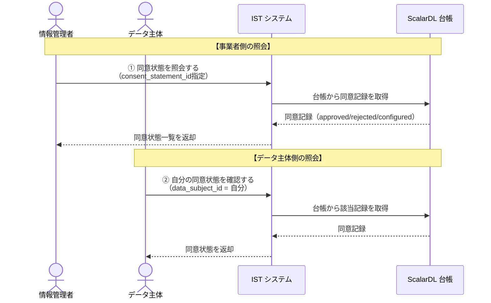
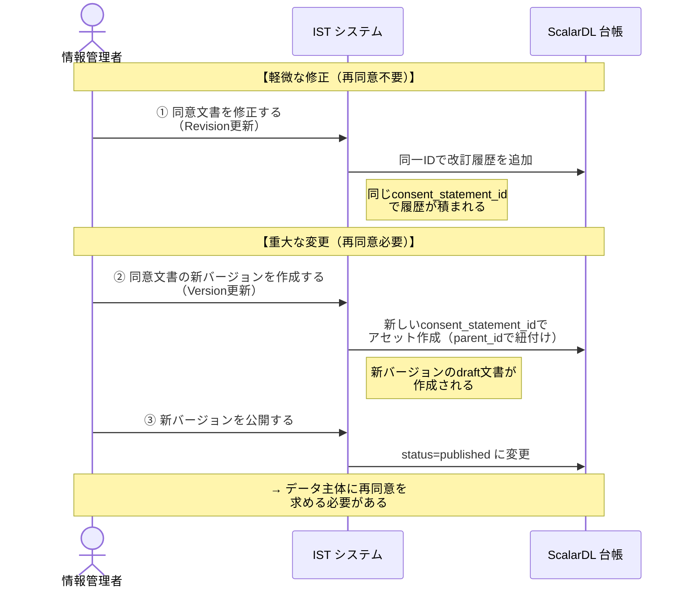
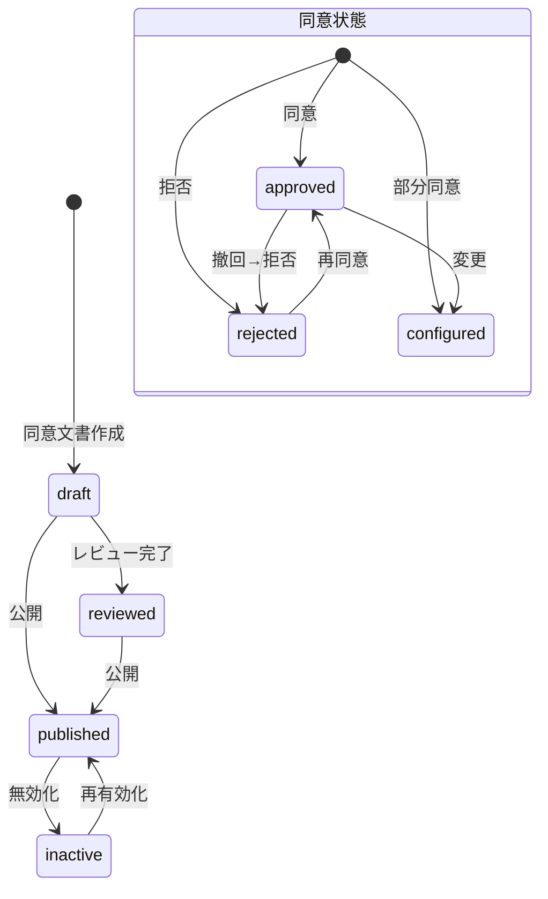
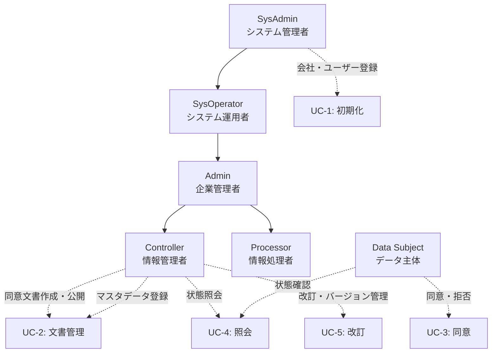

# Scalar IST ドメインストーリー

## ストーリー一覧

| # | ストーリー | アクター | 概要 |
|---|-----------|---------|------|
| 1 | [システム初期化](#1-システム初期化) | SysAdmin | 事業者・ユーザーの初期登録 |
| 2 | [同意文書の作成・公開](#2-同意文書の作成公開) | Controller | 同意文書のライフサイクル |
| 3 | [データ主体による同意・拒否](#3-データ主体による同意拒否) | Data Subject | 同意の意思表示 |
| 4 | [同意状態の照会](#4-同意状態の照会) | Controller / Data Subject | 同意記録の確認 |
| 5 | [同意文書の改訂](#5-同意文書の改訂) | Controller | 文書の修正・バージョン更新 |

---

## 1. システム初期化

**アクター**: システム管理者（SysAdmin）

**ユースケース定義**:

| UC-ID | ユースケース | アクター | 事前条件 | 事後条件 |
|-------|------------|---------|---------|---------|
| UC-1.1 | 会社を登録する | SysAdmin | システムが初期化済み | 会社がDBと台帳に記録される |
| UC-1.2 | 組織を作成する | SysAdmin/Admin | 会社が登録済み | 組織が会社に紐づいて記録される |
| UC-1.3 | ユーザーを登録する | SysAdmin/Admin | 会社・組織が登録済み | ユーザーにロールが付与される |

---

## 2. 同意文書の作成・公開

**アクター**: 情報管理者（Controller）

**ユースケース定義**:

| UC-ID | ユースケース | アクター | 事前条件 | 事後条件 |
|-------|------------|---------|---------|---------|
| UC-2.1 | 利用目的を登録する | Controller | ユーザーがController権限を持つ | 利用目的がDBと台帳に記録される |
| UC-2.2 | データセットスキーマを登録する | Controller | 同上 | データ項目定義が記録される |
| UC-2.3 | 便益を登録する | Controller | 同上 | データ主体への便益が記録される |
| UC-2.4 | 第三者提供先を登録する | Admin | Admin権限 | 提供先企業が記録される |
| UC-2.5 | 利用期限を登録する | Controller | Controller権限 | データ保持ポリシーが記録される |
| UC-2.6 | 同意文書を作成する | Controller | マスタデータ登録済み | draft状態の同意文書が作成される |
| UC-2.7 | 同意文書を公開する | Controller | 同意文書がdraft状態 | published状態に遷移する |

---

## 3. データ主体による同意・拒否

**アクター**: データ主体（Data Subject）

**ユースケース定義**:

| UC-ID | ユースケース | アクター | 事前条件 | 事後条件 |
|-------|------------|---------|---------|---------|
| UC-3.1 | 同意文書に同意する | Data Subject | 同意文書がpublished状態 | approved記録が台帳に保全 |
| UC-3.2 | 同意文書を拒否する | Data Subject | 同上 | rejected記録が台帳に保全 |
| UC-3.3 | 部分同意する | Data Subject | 同上 | configured記録（詳細付き）が保全 |
| UC-3.4 | 同意を撤回する | Data Subject | 同意済み | 同意状態が更新される |

---

## 4. 同意状態の照会

**アクター**: 情報管理者（Controller）/ データ主体（Data Subject）

**ユースケース定義**:

| UC-ID | ユースケース | アクター | 事前条件 | 事後条件 |
|-------|------------|---------|---------|---------|
| UC-4.1 | 同意状態を照会する（事業者） | Controller | 同意文書が存在する | 同意記録一覧が返却される |
| UC-4.2 | 自分の同意状態を確認する | Data Subject | 同意記録が存在する | 自分の同意状態が返却される |

---

## 5. 同意文書の改訂

**アクター**: 情報管理者（Controller）

**ユースケース定義**:

| UC-ID | ユースケース | アクター | 事前条件 | 事後条件 |
|-------|------------|---------|---------|---------|
| UC-5.1 | 同意文書を修正する | Controller | 同意文書が存在する | 改訂履歴が追加される（再同意不要） |
| UC-5.2 | 同意文書の新バージョンを作成する | Controller | 同意文書が存在する | 新バージョンがdraftで作成される |
| UC-5.3 | 旧バージョンを無効化する | Controller | 旧版がpublished | inactive状態に遷移する |

---

## ステータス遷移図

---

## アクター・ロール関係図

